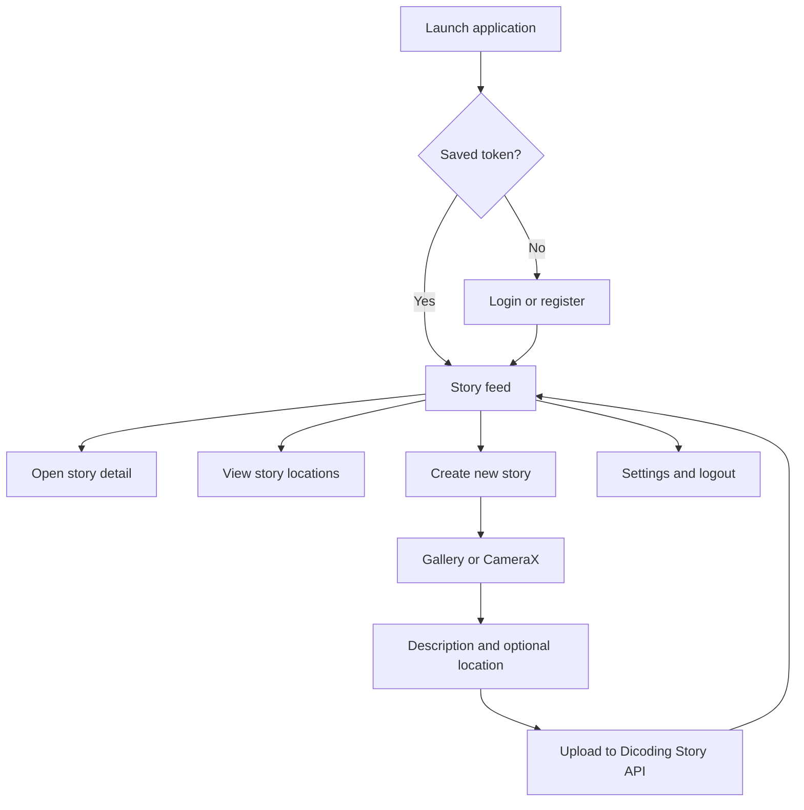
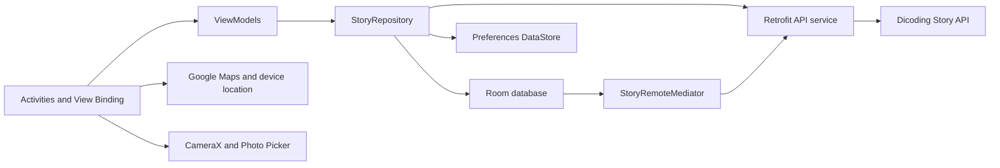

# StoryApp — Android Story Sharing App

**A native Android application for discovering, capturing, and sharing photo stories with location information.**

StoryApp is a Kotlin-based Android project developed as a **Dicoding — Belajar Pengembangan Aplikasi Android Intermediate** submission. It connects to the Dicoding Story API to handle account authentication, publish photo stories, browse other users' posts, and view their locations.

The project also explores several intermediate Android engineering concepts: **Paging 3 with RemoteMediator and Room, MVVM-style presentation, DataStore preferences, CameraX, Google Maps, and an Android home-screen widget**.

> **Project status:** educational application / course submission. Features below are documented from the source code, not from a verified production APK. A Google Maps API key still needs to be configured; some components, including the widget and instrumentation tests, would benefit from additional runtime verification.

## What the application does

StoryApp provides a straightforward flow from registration to creating and discovering stories:

1. **Sign up or log in** with a Dicoding Story API account.
2. **Explore the story feed**, with paginated data synchronized to a local Room database.
3. **Open a story** to see its image, author, and description.
4. **Create a story** using an existing photo or the built-in CameraX experience.
5. **Add optional location information** from the device's last known location.
6. **Explore story locations** as markers on Google Maps.
7. **Access preferences**, including language selection and logout.

The app is focused on image-based stories. It is not a note-taking app, live chat platform, or independent backend.

## Features

| Area | Current implementation |
| --- | --- |
| Authentication | Account registration and login via Dicoding Story API; bearer token saved with Preferences DataStore |
| Story feed | RecyclerView with Paging 3, load-state footer, and retry action |
| Local caching | Room stores story entities and pagination keys; RemoteMediator coordinates API and local data |
| Story details | Photo, author name, and description with a shared-element transition from the feed |
| Create story | Write a description, pick an image, or capture one with CameraX |
| Image processing | Convert image URI to a file and reduce image size before multipart upload |
| Geolocation | Optional location attachment using Fused Location Provider |
| Story map | Google Maps markers, custom map style, and map-type selection |
| Settings | English/Indonesian language setting persisted with DataStore; logout |
| Home-screen widget | Stack widget classes and layouts for displaying story images; real-device behavior not independently verified |
| Automated test sources | Unit tests for paginated story data; instrumentation tests for RemoteMediator and login/logout |

## User journey



### Story feed and pagination

The feed is more than a simple list request:

- The repository creates a `Pager` with a `PagingConfig` and a local `PagingSource`.
- `StoryRemoteMediator` retrieves remote pages and writes stories plus their pagination keys into Room inside a database transaction.
- A `PagingDataAdapter` renders the cached data and offers a retry footer when a page fails.
- `HomeViewModel` uses `cachedIn(viewModelScope)` to retain paged results across UI recreation.

This is a **network-backed paged cache**, not a guarantee that all stories remain accessible offline. Refresh behavior and availability still depend on the local database contents and the external API.

## Application architecture

The code separates screens, view models, a repository, remote API access, and local persistence.



**Key components**

- **UI:** Android activities for login, registration, feed, story detail, story creation, camera, maps, and settings.
- **Presentation:** ViewModels and `LiveData` handle asynchronous loading, success, and error states.
- **Repository:** `StoryRepository` exposes authentication, story uploads, detail requests, map data, and paged stories.
- **Persistence:** Room stores story objects and remote pagination keys; Preferences DataStore stores the token and app settings.
- **Networking:** Retrofit and OkHttp communicate with the Dicoding Story API.
- **Media/location:** CameraX captures images, Android Photo Picker selects images, and Google Play services provide maps and location APIs.

## Technology stack

| Layer | Technology |
| --- | --- |
| Language | Kotlin |
| UI | Android Views, XML layouts, View Binding, Material Components |
| Architecture | ViewModel, LiveData, Repository, Coroutines |
| API | Retrofit, Gson, OkHttp |
| Pagination | Android Paging 3 + RemoteMediator |
| Local data | Room database, Preferences DataStore |
| Camera and images | CameraX, Android Photo Picker, Glide |
| Maps and location | Google Maps SDK, Fused Location Provider |
| Additional UI | Facebook Shimmer, shared-element transitions |
| Testing | JUnit, Mockito, Espresso, MockWebServer, in-memory Room |
| Build | Gradle 8.2, Android Gradle Plugin 8.2.0, Kotlin 1.9.21 |

Android configuration from `app/build.gradle.kts`:

- **Minimum SDK:** 27 (Android 8.1)
- **Target / compile SDK:** 34
- **Application ID:** `com.dicoding.storyapp`

## Remote API

StoryApp is a client of the [Dicoding Story API](https://story-api.dicoding.dev/v1/); the backend is **not included** in this repository.

| Method | API route | Function |
| --- | --- | --- |
| `POST` | `/register` | Register an account |
| `POST` | `/login` | Log in and receive an access token |
| `GET` | `/stories?page=...&size=...` | Fetch a page of stories |
| `GET` | `/stories/{id}` | Fetch one story |
| `GET` | `/stories?location=1` | Fetch stories with locations |
| `POST` | `/stories` | Upload a photo and description, with optional latitude/longitude |

The app uses multipart form data for story creation. Authenticated requests attach the saved bearer token through an OkHttp interceptor.

## Getting started

### Prerequisites

- Android Studio with the Android SDK for API level 34.
- **JDK 17** compatible with Android Gradle Plugin 8.2.
- Android emulator or physical device running **API 27 or later**.
- Internet access and a valid Dicoding Story API account.
- A Google Maps API key for the map screens.

### Clone and configure

```bash
git clone https://github.com/alfrzhb/StoryApp.git
cd StoryApp
```

Open the repository in Android Studio, allow Gradle to sync, and check that your local `local.properties` includes the SDK path generated by Android Studio.

The app reads an **optional** `apiUrl` property from `local.properties`. When it is not provided, it uses the default endpoint `https://story-api.dicoding.dev/v1/`:

```properties
# Optional: override the Dicoding Story API base URL
apiUrl=https://story-api.dicoding.dev/v1/
```

### Google Maps configuration

The checked-in `AndroidManifest.xml` currently contains this placeholder:

```xml
<meta-data
    android:name="com.google.android.geo.API_KEY"
    android:value="PAKE API SENDIRI YAAAA" />
```

Before expecting maps to function, provision a **Google Maps SDK for Android** key and configure it for your application. For local experimentation you can replace the placeholder with your restricted development key; for a maintainable setup, use the already-declared Maps secrets Gradle plugin or another build-time configuration, and keep keys out of tracked source files.

Restrict the key to the Android app's package name and signing-certificate fingerprint, and enable the appropriate Google Maps API in your Google Cloud project. The repository inspection does **not** establish a valid configured key or operational map screens.

### Run and build

Select the `app` run configuration in Android Studio and start it on an emulator or device.

You can also build from a configured command-line environment:

```bash
# macOS / Linux
./gradlew assembleDebug
./gradlew testDebugUnitTest
```

```powershell
# Windows
.\gradlew.bat assembleDebug
.\gradlew.bat testDebugUnitTest
```

For device/emulator instrumentation tests, use the connected Android test task:

```bash
./gradlew connectedDebugAndroidTest
```

These are standard Gradle tasks for this Android project. **No Gradle build or test suite was executed during this documentation-only update.**

## Project structure

```text
app/src/main/
├── java/com/dicoding/storyapp/
│   ├── component/                  # Custom input component
│   ├── data/
│   │   ├── di/                     # Repository wiring
│   │   ├── retrofit/               # API definitions, OkHttp client
│   │   ├── response/               # API data models
│   │   └── StoryRemoteMediator.kt  # Remote pagination and cache updates
│   ├── database/                   # Room DAOs, database, remote keys
│   ├── repository/                 # StoryRepository
│   ├── helper/                     # ViewModel factory
│   ├── ui/
│   │   ├── login/                  # Login
│   │   ├── register/               # Registration
│   │   ├── home/                   # Paginated feed
│   │   ├── detail/                 # Story detail
│   │   ├── add/                    # Create story, image and location
│   │   ├── camera/                 # CameraX capture
│   │   ├── maps/                   # Google Maps view
│   │   └── settings/               # Language and logout
│   ├── utils/                      # Preferences, image helpers, adapters
│   └── widget/                     # Stack widget and RemoteViews
├── res/
│   ├── layout/                     # Screen and widget layouts
│   ├── drawable/                   # Icons and visuals
│   ├── raw/map_style.json          # Google Maps styling
│   └── values-in/strings.xml       # Indonesian localization
└── AndroidManifest.xml
```

## Testing

The repository includes dedicated test source files:

- **`HomeViewModelTest`** checks paged story data and empty-data behavior with mocked repository responses.
- **RemoteMediator instrumentation test** uses an in-memory Room database and a fake story API to check page-refresh behavior.
- **Login/logout instrumentation test** uses Espresso and MockWebServer to exercise an authentication navigation scenario.

These are **existing test cases**, not evidence of passing CI. Build/test results should be collected separately before making claims about test coverage or application stability.

## Current limitations and improvement opportunities

This is an educational implementation rather than a released product:

1. **Maps configuration:** the Android manifest still contains a placeholder API key. Map rendering needs a valid, restricted key.
2. **Remote dependency:** the story feed, authentication, uploads, and location data rely on the Dicoding Story API being reachable.
3. **Cached data is not a complete offline mode:** Room holds paged stories, but offline upload and full offline application behavior are not implemented.
4. **Widget verification:** a stack widget is implemented, but its asynchronous image loading and per-item rendering should be verified on real launchers/devices.
5. **Location permissions:** users need to grant the relevant Android location permission before optional coordinates can be attached.
6. **Persistence and migration:** Room uses destructive migration fallback; future schema updates should introduce explicit migrations to preserve cached records.
7. **Error handling:** some ViewModel and map flows would benefit from broader exception handling, empty-state checks, and lifecycle tests.
8. **Quality gates:** existing unit/instrumentation tests should be run regularly and supplemented with end-to-end smoke tests.

No production APK, Play Store listing, release artifact, or application screenshot is claimed without verification.

## License and acknowledgment

This repository includes the [Apache License 2.0](LICENSE).

Created as a **Dicoding Android Intermediate** learning/submission project, maintained by [alfrzhb](https://github.com/alfrzhb).

**Repository:** [github.com/alfrzhb/StoryApp](https://github.com/alfrzhb/StoryApp)
